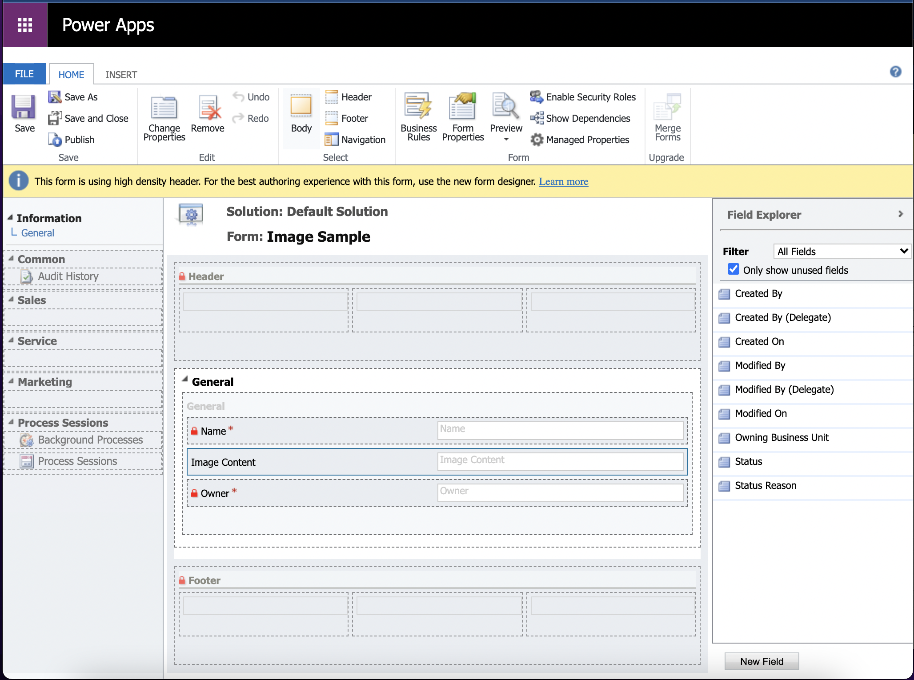
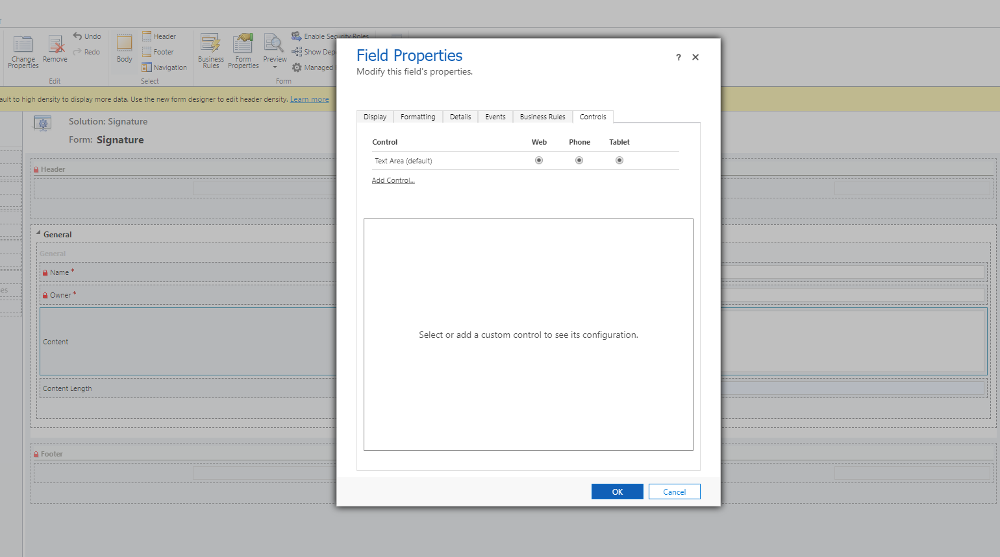
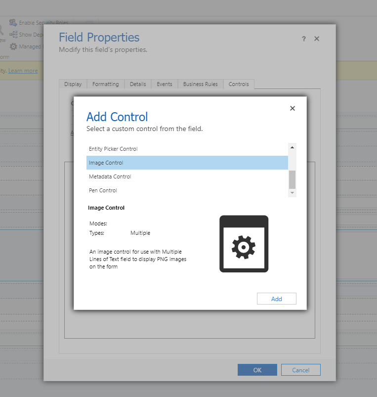
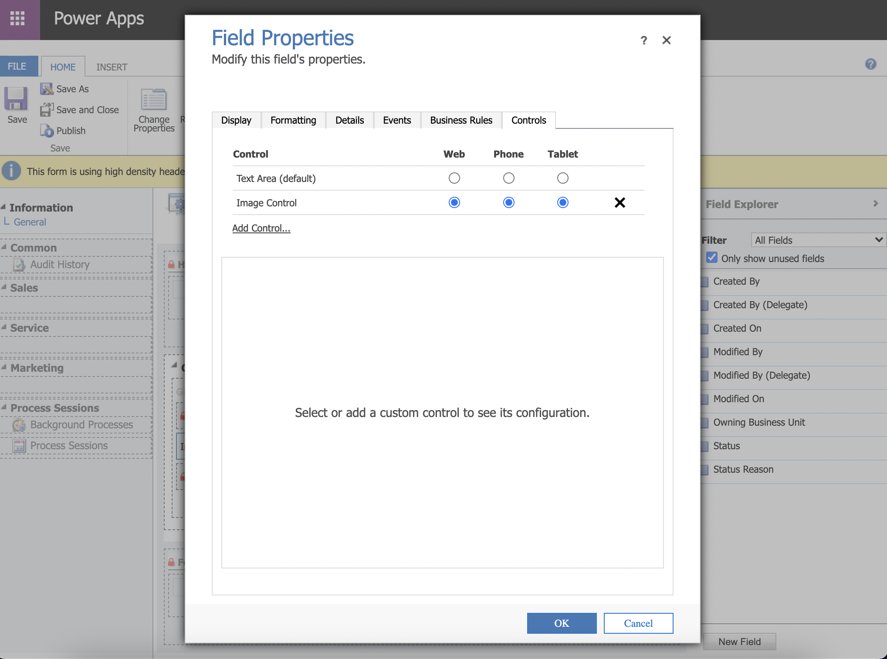
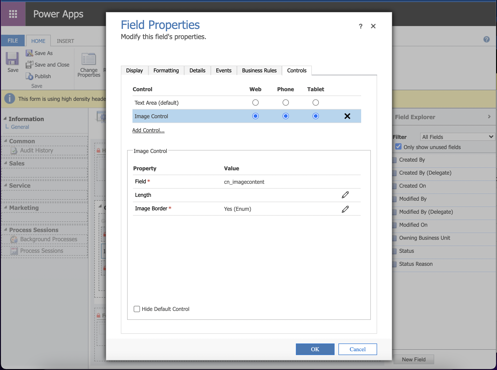
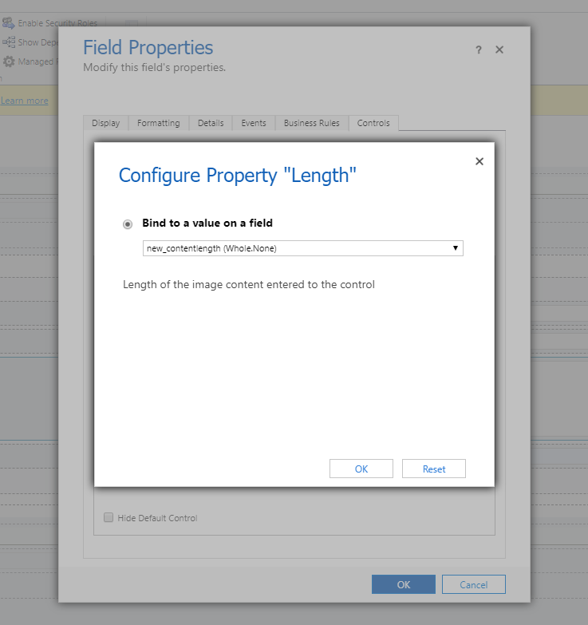
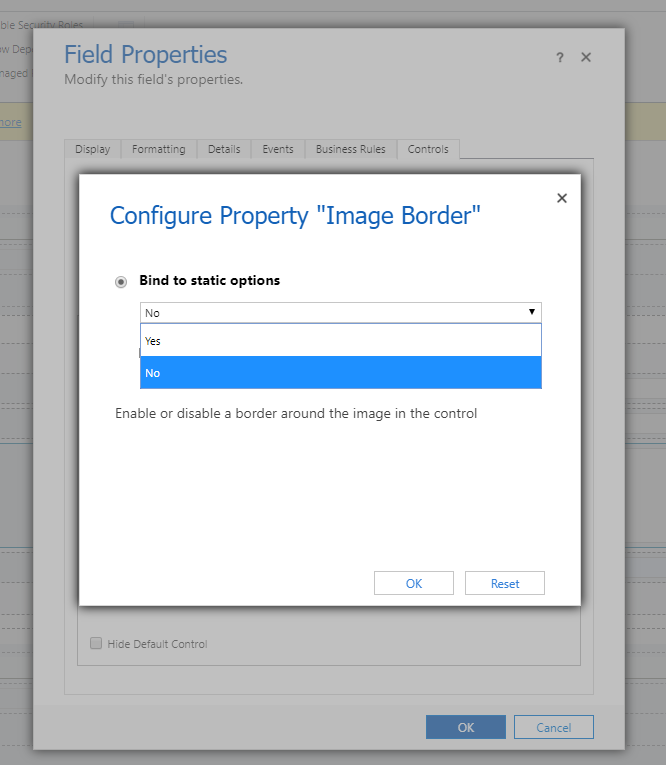
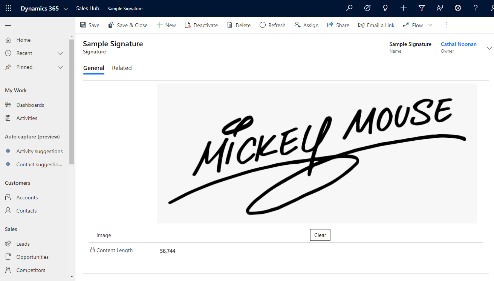
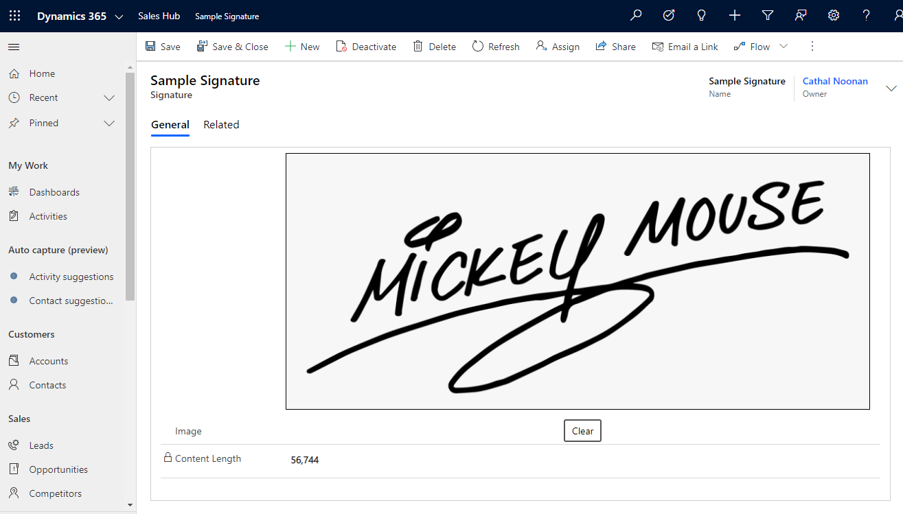
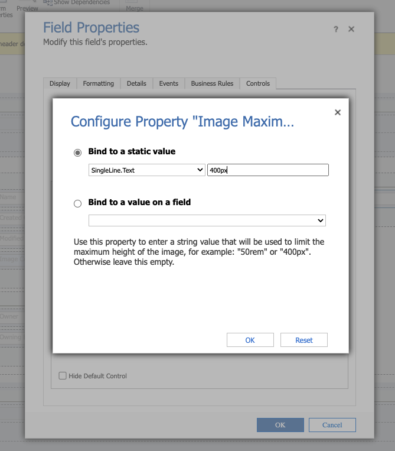

# Configuration

The control can be added to "Multiple Lines of Text" fields.

Open the form editor for the form that you wish to add the control to in the classic form editor.

Select a multiple lines of text field to designate for the control.
- If the field you wish to add to the form does not exist yet, it must be created first.
- Refer to the note at the bottom of this page for more information. \

Double click the multiple lines of text field, select the `Controls` tab and then click `Add Control...`. \

From the list of controls, select `Image Control` and click the `Add` button. \

After the control is added to the field, it must be selected for the `Web`, `Phone`, and `Tablet` options so that it will be displayed instead of the default control for a multiple lines of text field. \

After configuring the control to appear on web, phone, tablet, configure the remaining properties as necessary by selecting the `Image Control` control. \

## Properties

The options available to configure the control are as follows:
- Field (required, bound)
  - Automatically bound to the field that the control is added to.
- Length (optional, bound)
  - If configured, the control will set the length of the image's content to a second field.
  - The intention of this is to allow a customizer to alter the length of the Multiple Lines of Text field if there are many users below/close to the current length limit of the field.
- Image Border (required, input)
  - Decides whether to display a border around the image.
- Image Maximum Height (optional, input)
  - Introduced in `v1.5.0`.
  - If configured, the control will limit the max-height of the image to the specified value.
  - This value could be in pixels, or a relative unit such as rem.
  - For example `50rem` or `400px`.
  - To ignore this behavior, leave the field empty and it will use the maximum width available.

> **Note:**
>
> When the configuration is complete, don't forget to publish customizations.

### Length

The length field can be bound to a Whole Number field to give visibility of how many characters are filled in the Multiple Lines of Text field supporting the image.

### Image Border

A border can be displayed around the image to give an indication of any white (or empty) space included.

Selecting `No` will not display a border around the image.

Selecting `Yes` will display a border around the image.

### Image Maximum Height (CSS String)

To prevent images taking up too much space on the screen, the maximum height can be provided.

Entering a value will limit the height of the image displayed.

Leaving this field empty will not limit the height of the image, instead the image will scale based on the available width.

---

> **Note:**
>
> The value that will be stored in the field might be a high number of characters (it depends on the size of the image used).
>
> A suggestion to accept large images is to configure the multiple lines of text field to accept the maximum number of characters possible.
>
> If images larger than the configured field length are added, the image will be compressed since `v1.5.0`.
>
> In older versions of the control, larger images could not be used because an error would be thrown.

---

[home](../readme.md)
