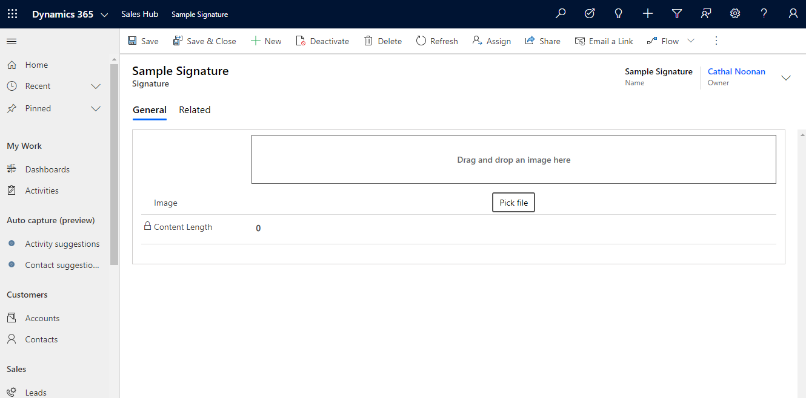
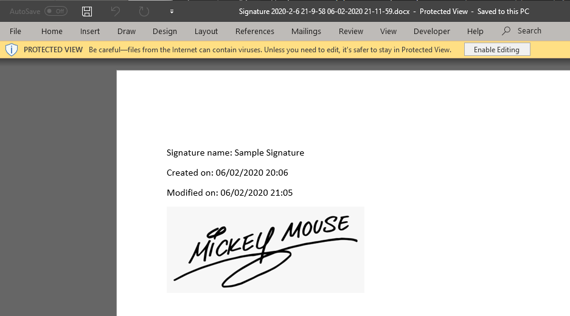

# D365 PCF - Image Control

## Image control for Multiple Lines of Text fields
This control can be added as a custom control for a Multiple Lines of Text field to display the contents as an image

The control will store the Base64 encoded content of the PNG image without the `data:image/png;base64,` at the start

This will allow us to output the image in a word document, as shown in the example below

---

## Download

The solution can be downloaded from the [Releases page](https://github.com/cathalnoonan/d365-pcf-imagecontrol/releases)

---

## Docs
- [Installation](./docs/installation.md)
- [Configuration](./docs/configuration.md)

## Development Docs
- [Building the control](./docs/building.md)
- [Adding translation](./docs/adding_translation.md)

---

> **Note:** 
>
> The maximum number of characters allowed in the Multiple Lines of Text field is `1,048,576` characters, which translates to 1MB.
> 
> The Control is designed to work with images below this size.
>
> If images larger than this size are required, the out-of-the-box [Image](https://docs.microsoft.com/en-us/powerapps/developer/data-platform/image-attributes), or [File](https://docs.microsoft.com/en-us/powerapps/developer/data-platform/file-attributes) field types may be a more suitable alternative. 
>
> The Image and File field types will allow larger images to be uploaded.

---

## License
MIT