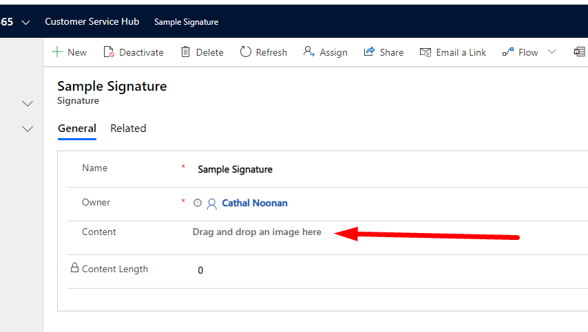
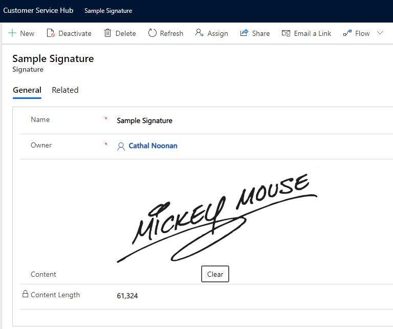
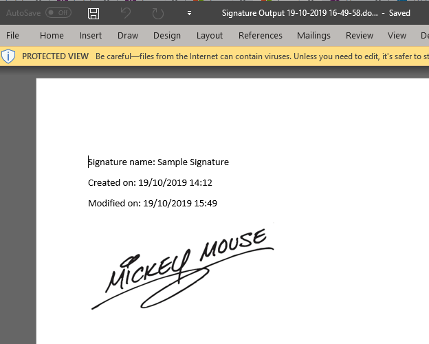
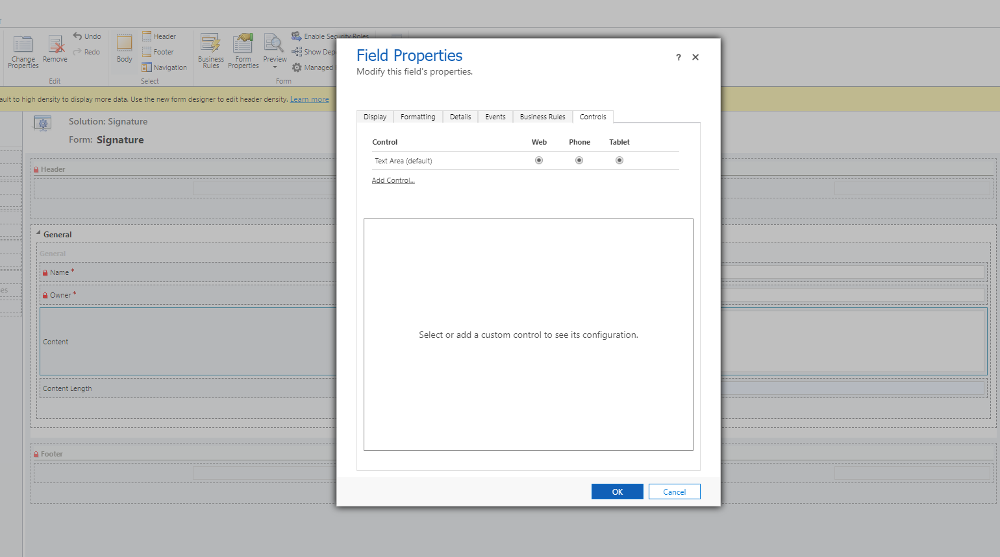
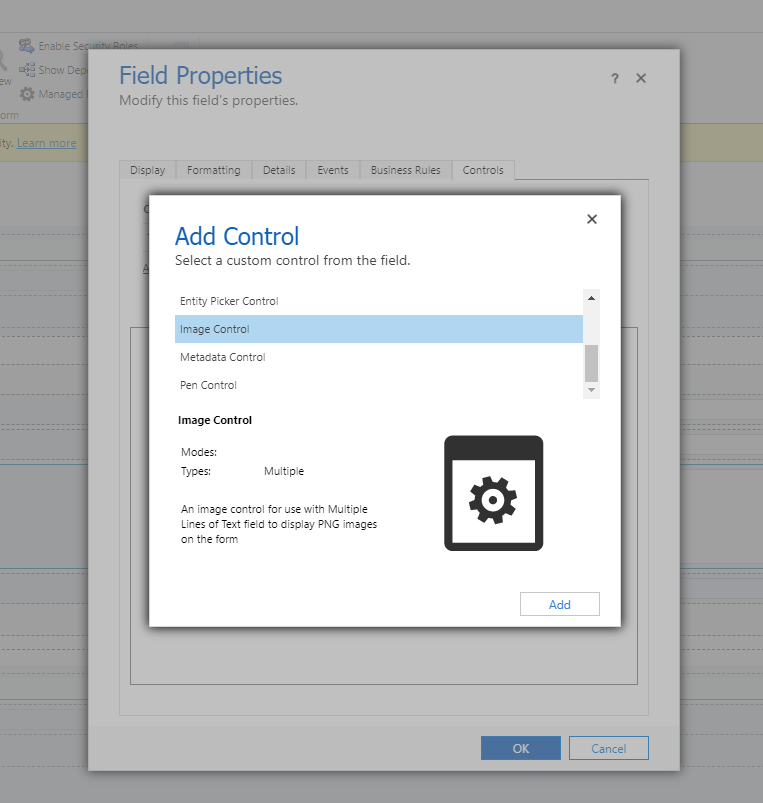
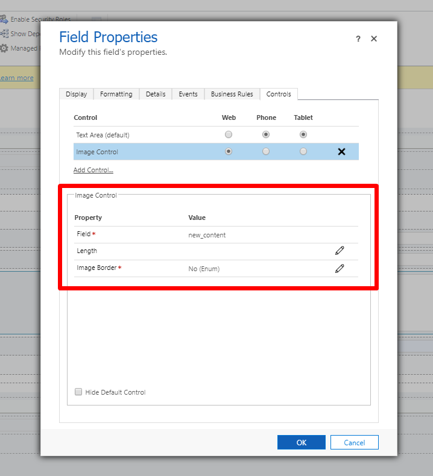
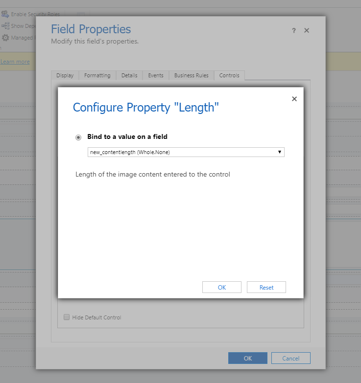
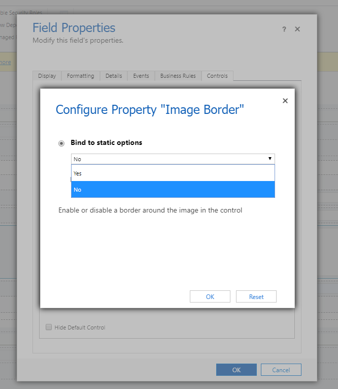
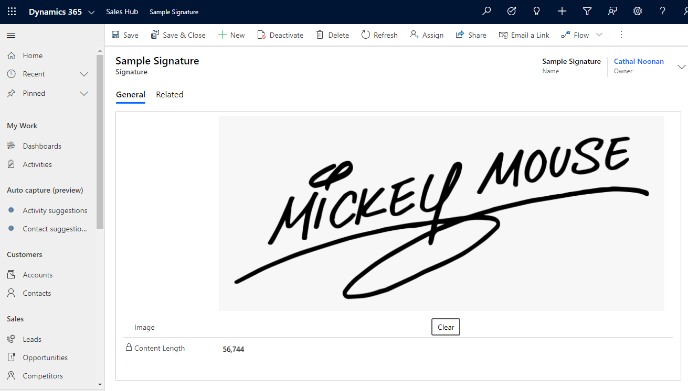
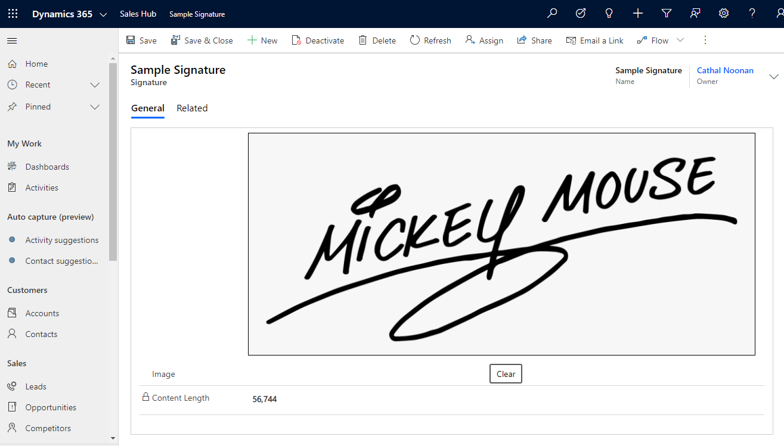

# D365 PCF - Image Control (PNG)
## Image control for Multiple Lines of Text fields
This control can be added as a custom control for a Multiple Lines of Text field to display the contents as an image

The control will store the Base64 encoded content of the PNG image without the `data:image/png;base64,` at the start

This will allow us to output the image in a word document, as shown in the example below

## Usage

Import the solution, then open the form editor that you would like to add the control to

The solution can be downloaded from the Releases page
([link](https://github.com/cathalnoonan/d365-pcf-imagecontrol/releases))

Open the properties of a Multiple Lines of Text field, click `Add Control...`

Select `Image Control` and configure the control

## Configuration

The options available to configure the control are as follows:
- Field (required, bound)
  - Automatically bound to the field that the control is added to
- Length (optional, bound)
  - If configured, the control will set the length of the image's content to a second field
  - The intention of this is to allow a customizer to alter the length of the Multiple Lines of Text field if there are many users below/close to the current length limit of the field
- Image Border (required, input)
  - Decides whether to display a border around the image

When the configuration is complete, don't forget to publish customizations

### Length

The length field can be bound to a Whole Number field to give visibility of how many characters are filled in the Multiple Lines of Text field supporting the image

### Image Border

A border can be displayed around the image to give an indication of any white (or empty) space included

Selecting `No` will not display a border around the image

Selecting `Yes` will display a border around the image

## Building The Project (DIY)
To build the project, clone the repository and open Visual Studio command prompt in that location

Run the following commands
- > cd src
- > npm install
- > cd Solutions
- > msbuild /t:build /restore

The solution files will be located at the following directory, relative to the project root
`src\Solution\bin\Debug`